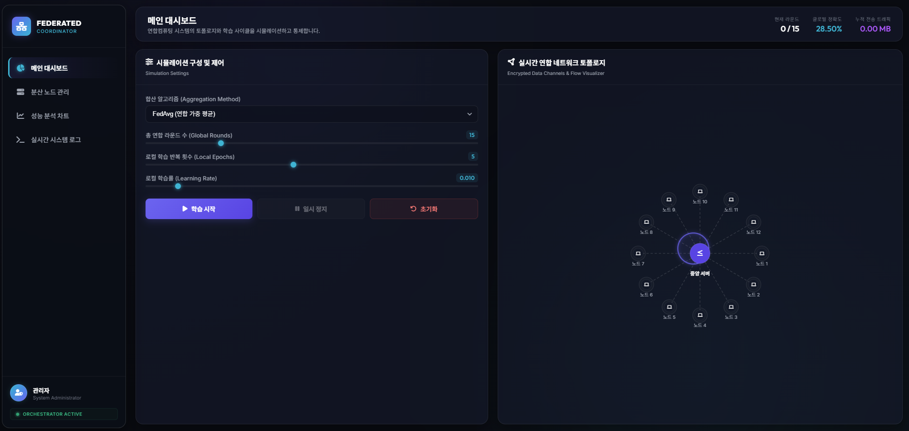
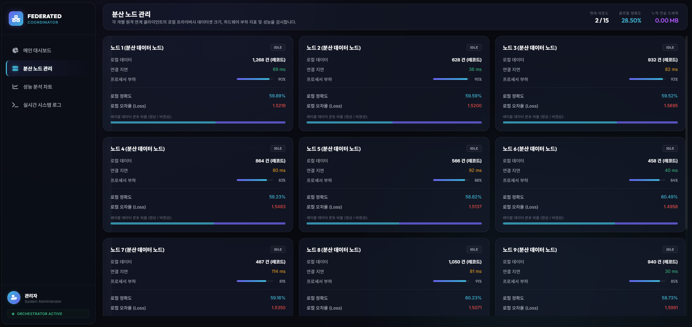
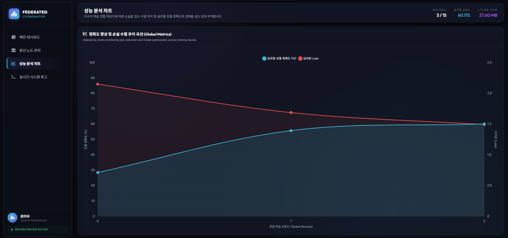
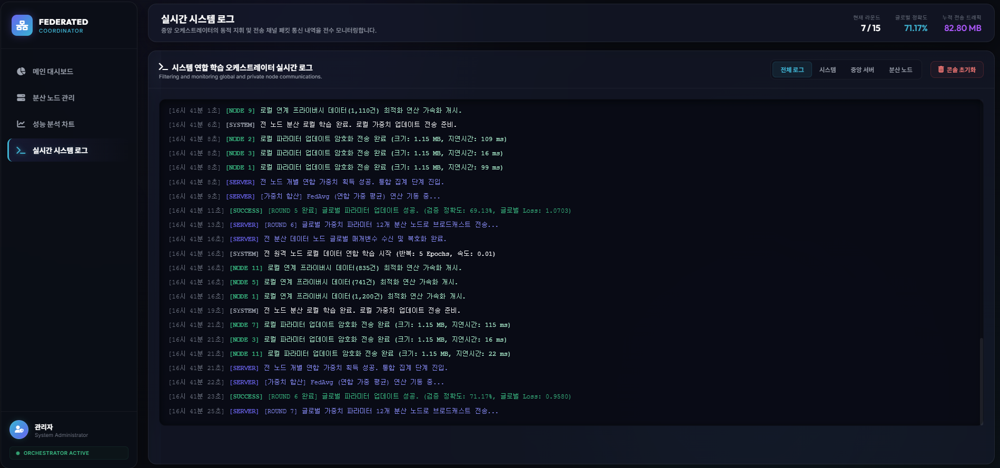

# 2026 연합컴퓨팅 오케스트레이터 및 대시보드

> **Federated Computing Orchestrator & Dashboard**
> 분산 노드의 연합학습(Federated Learning) 라운드를 실시간으로 시각화·통제하는 단일 페이지 애플리케이션입니다.



12개의 분산 노드와 중앙 서버로 구성된 연합학습 토폴로지를 시뮬레이션하고,
다운로드 → 로컬 학습 → 업로드 → 집계로 이어지는 라운드 사이클을
토폴로지·노드·차트·로그 네 가지 관점에서 모니터링합니다.

애플리케이션 소스는 [`fed/`](fed/) 디렉터리에 있습니다. (Vite + React 18 + TypeScript)

---

## 화면

### 메인 대시보드

연합학습 토폴로지와 학습 사이클을 시뮬레이션하고 통제합니다.
집계 알고리즘 선택, 라운드/에폭/학습률 슬라이더, 시작·일시정지·초기화 컨트롤과
중앙 서버를 둘러싼 12개 노드의 암호화 연합 네트워크 토폴로지를 함께 제공합니다.
(위 대표 화면 참고)

### 분산 노드 관리

각 원격 클라이언트의 로컬 프라이버시 데이터셋 크기, 하드웨어 부하 지표,
모델 정확도/손실을 노드 카드로 감시합니다.



### 성능 분석 차트

다수의 연합 라운드에 따른 손실값 감소 수렴 추이와 글로벌 모델 정확도의
진화를 정확도·손실 이중축 차트로 추적합니다.



### 실시간 시스템 로그

중앙 오케스트레이터의 지휘 명령과 전송 채널 패킷 통신 내역을
실시간 로그 콘솔로 모니터링하며, 전체/시스템/서버/노드 필터를 지원합니다.



---

## 빠른 시작

```bash
cd fed
npm install
npm run dev        # http://localhost:5173
npm run typecheck  # tsc --noEmit
npm run build      # tsc -b && vite build → dist/
npm run preview    # build 결과 미리보기
```

## 기술 스택

| 영역      | 사용 기술                              |
| --------- | ------------------------------------- |
| 빌드      | Vite 6 (HMR / 번들 / `tsc -b`)         |
| 프레임워크 | React 18                              |
| 언어      | TypeScript 5 (strict)                 |
| 상태 관리  | Zustand 5 (단일 진실의 원천)            |
| 차트      | Chart.js 4 + react-chartjs-2          |
| 스타일     | 순수 CSS (글래스모피즘 디자인 시스템)      |
| 폰트/아이콘 | Inter · Outfit · Font Awesome 6 (CDN) |

## 주요 기능

- 12개 분산 노드 + 중앙 서버 토폴로지 (SVG, 패킷 애니메이션)
- 4개 탭 — 메인 대시보드 / 분산 노드 관리 / 성능 분석 / 실시간 로그
- 3개 집계 알고리즘
  - **FedAvg** — 연합 가중 평균
  - **Federated Median** — 이상치에 견고
  - **Secure Aggregation** — 암호 보안 합산 (트래픽 비용 ↑)
- 라운드 / 로컬 에폭 / 학습률 슬라이더 + 알고리즘 선택
- 다운로드 → 학습 → 업로드 → 집계 4단계 사이클 애니메이션
- 실시간 정확도·손실 이중축 차트
- 로그 콘솔 + 4가지 필터 (전체 / 시스템 / 서버 / 노드)
- Idle 상태 시스템 하트비트 로그
- 시작 / 일시정지 / 초기화 + 재시작 흐름

## 프로젝트 구조

```
.
├── fed/         # 연합컴퓨팅 오케스트레이터 (Vite + React + TS) ← 메인 앱
│   ├── src/     # main / App / views / components / store / hooks / lib
│   └── _legacy/ # vanilla v0.1 (HTML/CSS/JS) 원본 보관
├── img/         # 화면 캡처
└── README.md
```

자세한 앱 아키텍처·데이터 흐름·설정값은 [`fed/README.md`](fed/README.md)를 참고하세요.
