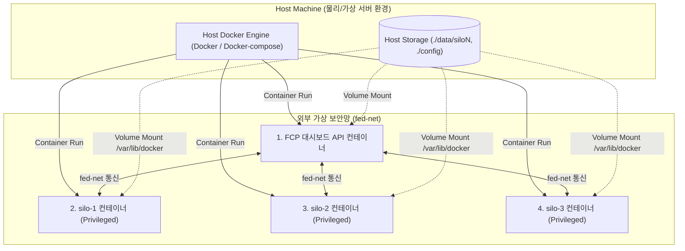
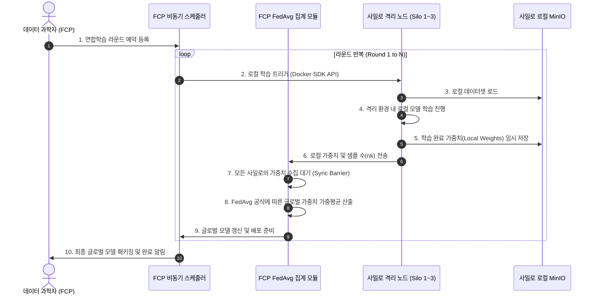

# [ARCHITECTURE.md] 분산형 데이터 연합컴퓨팅 플랫폼 아키텍처 명세서
(PoC Comprehensive Architecture Specification)

본 문서는 **데이터 활용 강화를 위한 분산형 데이터 연합컴퓨팅 플랫폼 PoC**의 물리적(Physical), 논리적(Logical) 구조와 함께 데이터 흐름(Data Flow) 및 보안/격리 경계(Security Boundary)를 종합적으로 기술한 **독립형 아키텍처 명세서**입니다.

---

## 1. 물리 배포 아키텍처 (Physical Deployment Architecture)

시스템의 기동 및 네트워크 바인딩을 기반으로 한 물리적 인프라 구성도입니다.



### 1.1 주요 컴포넌트별 샌드박싱 방식
* **FCP 대시보드 API**: 호스트의 Docker 소켓(`/var/run/docker.sock`)을 바인드 마운트하여 원격 도커 엔진을 탐지하고 제어하는 조율자 역할을 합니다.
* **격리 사일로 (Silo 1~3)**: Ubuntu 22.04 이미지에 SSH 서버, Docker 엔진을 내장한 **Docker-in-Docker (DinD)** 형태로 실행됩니다. `privileged: true` 플래그를 통해 자체 도커 데몬을 실행하며, 호스트의 개별 볼륨 경로(`./data/siloN`)를 마운트하여 데이터가 완전 격리된 영구 볼륨을 사용합니다.

---

## 2. 논리/모듈 아키텍처 (Logical & Directory Architecture)

중앙 FCP 컨트롤러 API 엔진의 내부 계층 구조 및 모듈 아키텍처입니다.

```
+--------------------------------------------------------------------------+
|                     FastAPI HTTP / Web UI Layer                          |
|    - /dashboard (React SPA / Jinja2 UI)                                  |
|    - /healthz, /readyz (시스템 건전성 진단)                              |
+--------------------------------------------------------------------------+
                                     |
                                     v
+--------------------------------------------------------------------------+
|                       API Router Controller Layer                        |
|    - Models/Deployments Router (모델 패키징 및 배포 제어)                |
|    - Silo/Rounds Router (사일로 그룹핑 및 FedAvg 파라미터 수합)          |
|    - Cleaning Router (원격 데이터 정제 레시피 및 Job 기동)               |
|    - Resource/Monitoring Router (CPU, GPU, 메트릭, 드리프트 계산)        |
+--------------------------------------------------------------------------+
                                     |
                                     v
+--------------------------------------------------------------------------+
|                       Core Services & Logic Layer                        |
|    - Docker Service (Docker SDK 활용 원격 노드 API 통신 객체 캐싱)       |
|    - Round Scheduler (APScheduler 기반 비동기 주기 배치 잡 실행)         |
|    - FedAvg Module (로컬 모델 파라미터 가중평균 산출)                    |
+--------------------------------------------------------------------------+
                                     |
                                     v
+--------------------------------------------------------------------------+
|                       Config & Persistence Layer                         |
|    - Settings Config (Base Env & API Key)                                |
|    - Server Manager (config/servers.yaml 파싱 및 파일 영속화)            |
+--------------------------------------------------------------------------+
```

---

## 3. 핵심 데이터 플로우 아키텍처 (Data Flow Architecture)

연합 학습 라운드 및 파라미터 수집 주기 동안 시스템 전체에서 발생하는 비동기 데이터 흐름 명세입니다.



---

## 4. 보안 및 격리 경계 아키텍처 (Security & Isolation Boundary)

연합컴퓨팅에서 가장 중요한 **데이터 소유권 보호** 및 **경계 보안** 설계입니다.

```
       [ 외부망 및 사용자 접속 ]
                  │
                  ▼
┌───────────────────────────────────────┐
│       FCP 중앙 API 엔진 경계          │
│  - X-FED-API-Key 헤더 검증 미들웨어   │
└───────────────────────────────────────┘
                  │  (인증 및 권한 인가 완료)
                  ▼
┌───────────────────────────────────────┐
│     fed-net 외부 가상 브릿지 세그먼트 │
│  - 외부 인터넷망과 다이렉트 바인딩 차단│
└───────────────────────────────────────┘
                  │
        ┌─────────┼─────────┐  (격리 채널 통신)
        ▼         ▼         ▼
┌──────────────┐┌──────────────┐┌──────────────┐
│ Silo 1 경계  ││ Silo 2 경계  ││ Silo 3 경계  │
│  - DinD 격리 ││  - DinD 격리 ││  - DinD 격리 │
│  - MinIO S3  ││  - MinIO S3  ││  - MinIO S3  │
└──────────────┘└──────────────┘└──────────────┘
```

1. **API Key 인입 차단 필터**: 외부 및 프론트엔드로부터의 악성 요청이나 무단 제어 명령을 `/api` 진입점 미들웨어 수준에서 전면 필터링합니다.
2. **네트워크 통제 경계**: 사일로 컨테이너 내부의 `dockerd` 및 `MinIO`는 호스트의 포트(`237x`, `700x`)에 맵핑되나, 이는 로컬 또는 인증된 FCP 컨테이너와의 통신용으로만 제한되어 외부 다이렉트 유입을 허용하지 않습니다.
3. **완벽한 데이터 격리 (Zero-Leakage)**: 
   * 사일로 샌드박스 외부에서는 사일로 로컬 데이터셋 파일에 대한 직접 접근이 불가능합니다.
   * 연합 학습 라운드 및 정제 요청 시 오직 추론 코드 배포 지시와 결과 가중치(Weights) 파일 송출 통로만 개방됩니다.
