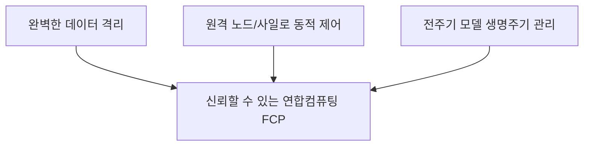
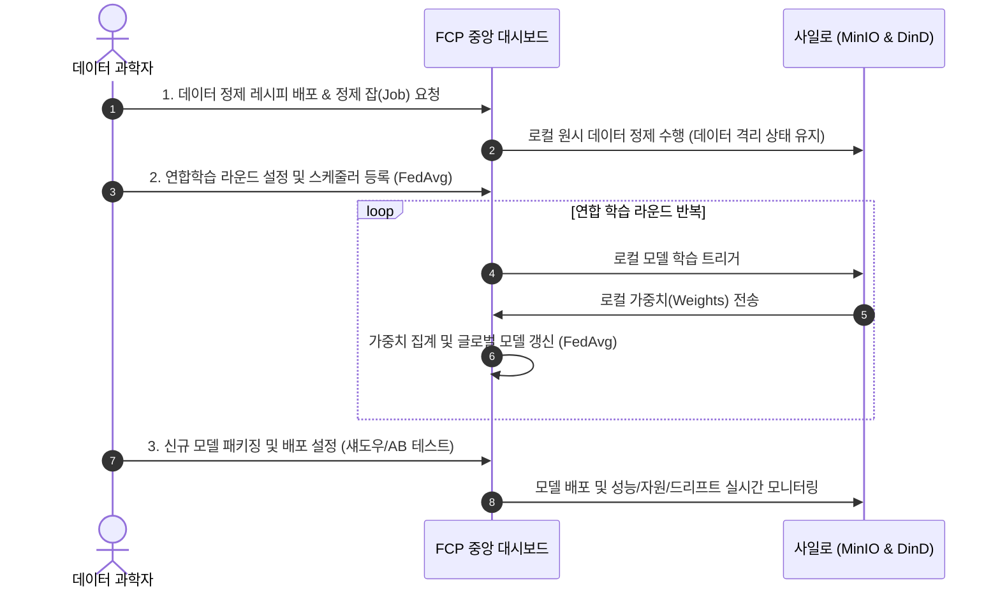

# [PRD] 분산형 데이터 연합컴퓨팅 플랫폼 제품 요구사항 정의서
(Product Requirement Document)

| 프로젝트명 | 데이터 활용 강화를 위한 분산형 데이터 연합컴퓨팅 기술 개발 및 실증 (PoC) |
| --- | --- |
| 문서 버전 | v1.0 |
| 작성일자 | 2026-05-27 |
| 작성자 | RND 연구개발팀 (Antigravity AI) |
| 대상 범위 | 3차년도 연구과제 통합 연합컴퓨팅 플랫폼 (FastAPI 통합 백엔드 & React/Vanilla UI & DinD Silo) |

---

## 1. 프로젝트 배경 및 목적

### 1.1 배경
* **데이터 사일로 현상 및 규제 강화**: 개인정보보호법 및 가명정보 가이드라인 강화로 인해 민감한 의료, 금융, 공공 데이터를 한 곳으로 집중시켜 AI 모델을 학습하는 것이 법적/제도적으로 불가능해짐.
* **데이터 소유권 및 격리성 요구**: 참여 기관(사일로)들은 자신들의 로컬 데이터가 외부 시스템으로 유출되거나 직접 노출되는 것을 강력히 거부하며, 완전하게 격리된 샌드박스 환경에서의 학습 및 연산만을 원함.

### 1.2 목적
* **원격 데이터 격리 및 분산 연합컴퓨팅**: 데이터가 보관된 각 사일로(Silo)에 물리적으로 독립된 컨테이너 환경(Docker-in-Docker & MinIO)을 배포하여 데이터를 절대 외부로 유출하지 않으면서도, 모델 파라미터만을 안전하게 수집해 글로벌 모델을 갱신하는 연합컴퓨팅 플랫폼 구축.
* **PoC(개념 검증)의 지향점**: 중앙 대시보드(FastAPI + React)를 통해 분산된 멀티 노드 및 격리 사일로를 효과적으로 관리하고, 데이터 정제부터 연합 학습 스케줄링, 모델 배포, 섀도우/AB 테스트 및 성과 시각화까지의 전 과정을 검증함.

---

## 2. 제품 비전 및 핵심 가치 (Core Values)

1. **절대적 보안 및 데이터 격리 (Zero-Trust Data Isolation)**
   * 각 사일로에는 개별 Docker 데몬(Docker-in-Docker)과 독립된 오브젝트 스토리지(MinIO)가 탑재되어 물리적으로 완벽히 격리된 학습 환경을 제공합니다.
2. **통합 원격 제어 및 모니터링 (Centralized Orchestration)**
   * 다중 Docker 호스트 노드들의 연결을 실시간으로 확인하고, 컨테이너 기동/정지/재시작 및 리소스 모니터링을 중앙 웹 대시보드에서 일관되게 제어합니다.
3. **지능형 연합컴퓨팅 파이프라인 (Intelligent FL Pipeline)**
   * 데이터의 정제(Preprocessing Recipes), 비동기 배치 스케줄링, 연합 파라미터 집계(FedAvg), 모델 패키징 및 다중 배포 방식(섀도우 배포, A/B 테스트)을 아우르는 전체 MLOps 수명주기를 완성합니다.

---

## 3. 사용자 페르소나 및 유스케이스

### 3.1 사용자 페르소나
1. **플랫폼 관리자 (Platform Operator)**
   * **목표**: 분산된 다기관의 Docker 노드 시스템 연결 상태를 관리하고 하드웨어 자원(CPU, GPU, Memory)의 안전성을 모니터링합니다.
   * **고통점**: 물리적으로 떨어진 원격 서버들의 Docker 컨테이너 상태와 통신 장애를 한눈에 파악하기 어렵고 관리가 번거로움.
2. **AI/데이터 과학자 (Data Scientist / Researcher)**
   * **목표**: 분산 데이터셋의 보안을 유지하면서 정제 레시피를 배포하고, 연합학습 라운드를 예약 실행하며, 학습된 글로벌 모델의 드리프트(Drift) 분석 및 섀도우 배포 검증을 진행합니다.
   * **고통점**: 사일로별로 데이터 형태가 달라 정제가 어렵고, 수동으로 파라미터를 취합하는 과정이 복잡하고 비효율적임.
3. **사일로 참여 기관 담당자 (Silo Participant)**
   * **목표**: 로컬 데이터를 안전하게 MinIO 스토리지에 적재하고 로컬 연산 작업이 보안 구역(샌드박스) 내부에서만 도는 것을 보증받습니다.

### 3.2 주요 사용자 흐름 (User Flows)

---

## 4. PoC 범위 및 핵심 기능 요구사항

연구 과제 3차년도 결과물의 성공적인 검증을 위해, 본 PoC는 기능을 **P0(필수 요구사항)**, **P1(중요 요구사항)**, **P2(확장/데모 시각화)** 로 분류하여 정의합니다.

### 4.1 P0: 모델 수명주기 및 격리 인프라 (Must-Have)

#### [REQ-P0-01] 모델 패키징 및 가입소 (Model Packaging & Registry)
* **설명**: 학습이 완료된 모델 또는 외부 유입 모델을 연합컴퓨팅 규격에 맞게 메타데이터(프레임워크, 버전, 타겟 태스크)와 함께 패키징하여 시스템에 등록할 수 있어야 한다.
* **기능**:
  * 모델 바이너리 및 구성 파일 아카이빙.
  * 레지스트리 업로드 및 버전 관리 (v1.0.0, v1.1.0 등).
  * 패키징 이력 추적 및 롤백 기능 지원.

#### [REQ-P0-02] 모델 배포 및 제어 (Model Deployment)
* **설명**: 등록된 모델 패키지를 중앙 대시보드에서 타겟 연합 노드/사일로에 동적으로 배포하고 기동할 수 있어야 한다.
* **기능**:
  * 타겟 노드 선택 및 모델 배포 API 호출.
  * 배포된 추론/학습 컨테이너의 라이프사이클 관리 (Start/Stop/Restart).

#### [REQ-P0-03] 데이터 물리 격리 사일로 (Silo Sandboxing)
* **설명**: 각 연합 참여 클라이언트는 물리적인 데이터 보안을 위해 호스트와 분리된 완전한 격리 환경이어야 한다.
* **기능**:
  * **Docker-in-Docker (DinD)** 기술을 적용하여 사일로 내부에서 독립된 Docker 컨테이너 실행 보장.
  * 사일로 내부 전용 **MinIO Object Storage**를 내장하여 학습 데이터셋 및 중간 산출물 격리 저장.

---

### 4.2 P1: 연합학습 파이프라인 및 유지관리 (Should-Have)

#### [REQ-P1-01] 사일로 링크 및 파라미터 수집 (Silo Link & Parameter Aggregation)
* **설명**: 여러 개의 격리 사일로를 하나의 '사일로 그룹'으로 묶고, 연합 학습 라운드에 따라 안전한 가중치 교환 프로토콜을 수행해야 한다.
* **기능**:
  * 동적 사일로 가입 및 그룹핑.
  * 라운드 관리: 각 라운드별 가중치 수집 대기 및 에러 복구.
  * **FedAvg** 알고리즘을 기반으로 한 파라미터 중앙 가중 평균 집계 모듈.

#### [REQ-P1-02] 자동 배치 스케줄러 (Batch Scheduling)
* **설명**: 특정 주기(정기 실행, 야간 시간대 등)에 맞춰 학습 잡(Job)과 정제 잡(Job)을 예약하고 자동 수행한다.
* **기능**:
  * 비동기 작업 스케줄러 내장 (`APScheduler` 등 활용).
  * 배치 주기 등록(Cron 표현식 지원), 실패 시 재시도 로직.

#### [REQ-P1-03] 리소스 및 모델 모니터링 (Resource & Model Monitoring)
* **설명**: 전체 노드와 개별 사일로의 하드웨어 리소스 및 모델 운영 상태를 실시간 관제한다.
* **기능**:
  * 노드/사일로별 CPU, GPU, 메모리, 디스크 사용률 수집.
  * 데이터 분포의 변화를 추적하는 **데이터/모델 드리프트(Drift) 탐지**.
  * 모델 성능 메트릭 (Loss, Accuracy 등)의 라운드별 모니터링.

#### [REQ-P1-04] 데이터 전처리 및 정제 (Data Cleaning Pipelines)
* **설명**: 각 사일로의 데이터 스키마 및 결측치를 로컬 격리 구역 내에서 사전 가공할 수 있는 데이터 정제 인프라를 제공한다.
* **기능**:
  * 데이터 정제 레시피(Recipe) 정의 및 배포.
  * 각 노드별 데이터 정제 잡(Cleaning Job) 실행 제어.

#### [REQ-P1-05] 모델 계보(Lineage) 및 고급 배포 (Advanced MLOps)
* **설명**: 모델의 탄생부터 폐기까지의 흐름을 투명하게 추적하고, 리스크 없는 검증을 위한 무중단/비교 배포 기법을 지원한다.
* **기능**:
  * **Model Lineage**: 모델 학습에 사용된 정제 레시피, 학습 라운드, 참여 사일로, 로컬 데이터셋 버전 추적.
  * **섀도우 배포 (Shadow Deployment)**: 운영 트래픽이나 실제 데이터 스트림을 복사하여 신규 모델에 흘려보내 성능을 비교하되, 실제 예측 서비스에는 영향을 주지 않는 안전 배포 기법.
  * **A/B 테스트**: 사일로 그룹별 또는 사용자별 배포 비중을 조절하여 (예: A그룹 50%, B그룹 50%) 모델의 성능을 상호 대조.

---

### 4.3 P2: 시각화 및 데모 UI (Nice-to-Have)

#### [REQ-P2-01] 사일로 데이터 시각화 (Silo KPI Visualizations)
* **설명**: 공인인증 규격에 준하는 핵심 성능 지표(KPI) 5종을 정의하고, 최대 6개 사일로에 대해 시각화 대시보드를 제공한다.
* **기능**:
  * 5대 KPI: 연합 학습 시간, 데이터 정제 정확도, 모델 드리프트율, 통신 오버헤드, 리소스 효율성.
  * 다차원 인터랙티브 차트(Line, Bar, Gauge, Heatmap 등)를 통한 정보 요약.

#### [REQ-P2-02] 통합 비동기 I/O 대시보드 (Integrated Async UI)
* **설명**: 대규모 노드에서 비동기로 전달되는 메트릭과 컨테이너 상태 변화를 화면 멈춤(Blocking) 없이 미려하게 시각화하는 모던 웹 UI를 제공한다.
* **기능**:
  * React SPA 기반 대시보드 페이지 (`/dashboard`).
  * 비동기 데이터 로딩 및 주기적 갱신 처리.
  * 다크 모드(Dark Mode) 및 Harmony Color Palette가 적용된 현대적 디자인 레이아웃.

---

## 5. 비기능적 요구사항 (Non-Functional Requirements)

* **보안성 (Security)**:
  * 중요 API 엔드포인트는 `FED_API_KEY` 환경변수로 정의된 고유 키를 기반으로 `X-FED-API-Key` 헤더 인증을 거쳐야만 호출을 허용함.
  * 원격 Docker 호스트 통신에는 안전한 포트 바인딩 및 TLS 통신 옵션을 고려함.
* **성능 및 동시성 (Performance)**:
  * 다수 노드로부터 전달되는 파라미터 취합 및 대용량 메트릭 모니터링 시 FastAPI의 비동기 I/O (`async/await`)를 최적화하여 시스템의 응답 속도를 유지함.
* **안정성 (Reliability)**:
  * 특정 사일로의 이탈이나 통신 장애 발생 시, 연합 학습 라운드가 정지되지 않고 최소 사일로 조건 충족 시 학습이 유지되도록 예외 처리 구현.

---

## 6. 마일스톤 및 성공 지표 (Milestones & Success Metrics)

### 6.1 PoC 주요 단계
1. **1단계: 인프라 및 격리 환경 검증** (DinD, MinIO 및 외부 네트워크 `fed-net` 연결성 확인)
2. **2단계: 데이터 정제 및 스케줄링 검증** (Batch Job 설정에 따른 분산 전처리 및 데이터 로드 성공률 100%)
3. **3단계: 연합학습 및 파라미터 집계** (FedAvg 라운드 루프 정상 완주 및 가중치 집계 정확성 확인)
4. **4단계: MLOps 및 고급 배포** (섀도우/AB 테스트 기동 및 실시간 드리프트/리소스 모니터링 수집 테스트)
5. **5단계: 데모 시각화** (통합 대시보드 UI를 통한 5종 KPI 시각화 데모 시연)

### 6.2 성공 지표 (Success Metrics)
* **사일로 데이터 격리성**: 로컬 원시 데이터의 사일로 외부 유출 시도 차단율 100%.
* **연합 컴퓨팅 완수율**: 10회 이상의 연속 학습 라운드 동작 시 예외 없는 정상 가중치 수집 및 FedAvg 처리 완료.
* **UI 반응 시간**: 통합 대시보드 렌더링 지연 시간 1초 미만, 실시간 메트릭 비동기 로딩 정상 지원.
